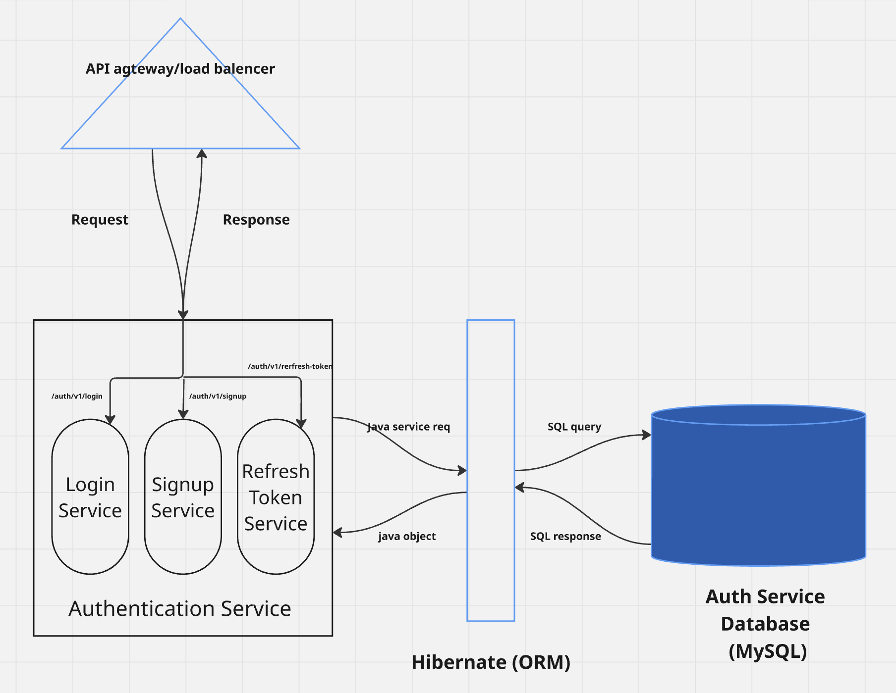

# 🔐 Authentication Microservice

An enterprise-grade **Authentication Service** built with **Spring Boot**, **Hibernate (ORM)**, and **MySQL**, providing secure login, signup, and refresh token functionality.

---

## ⚙️ System Architecture



This diagram illustrates the flow from API Gateway through microservices to the database:

- **API Gateway/Load Balancer** routes the requests.
- **Authentication Service** handles:
  - `/auth/v1/login`
  - `/auth/v1/signup`
  - `/auth/v1/refresh-token`
- **Hibernate** bridges Java objects to SQL.
- **MySQL** stores user, token, and role data securely.

---

## 🚀 Features

- ✅ JWT-based stateless authentication
- 🔄 Secure refresh token flow
- 🔐 Role-based access control (RBAC)
- 🛡️ Input validation and exception handling
- 📦 Modular architecture

---

## 🔧 Tech Stack

| Layer             | Technology    |
|------------------|---------------|
| Language          | Java          |
| Framework         | Spring Boot   |
| ORM               | Hibernate     |
| Database          | MySQL         |
| Auth Protocol     | JWT           |
| Build Tool        | Maven         |

---


## 📁 API Endpoints

| Method | Endpoint                | Description           |
|--------|-------------------------|-----------------------|
| POST   | `/auth/v1/login`        | Authenticates user    |
| POST   | `/auth/v1/signup`       | Registers new user    |
| POST   | `/auth/v1/refresh-token`| Issues new access token|

---

## 🧪 Run Locally

```bash
# Clone the repo
git clone https://github.com/your-username/auth-service.git
cd auth-service

# Build the app
./mvnw clean install

# Run the app
./mvnw spring-boot:run
